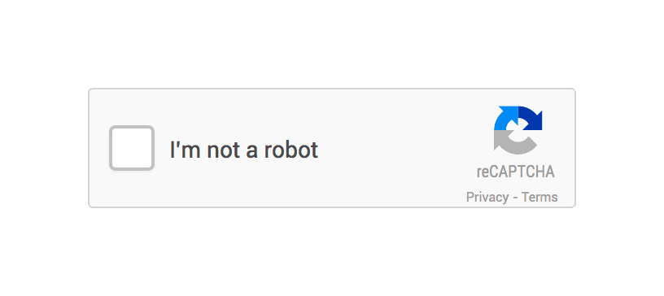
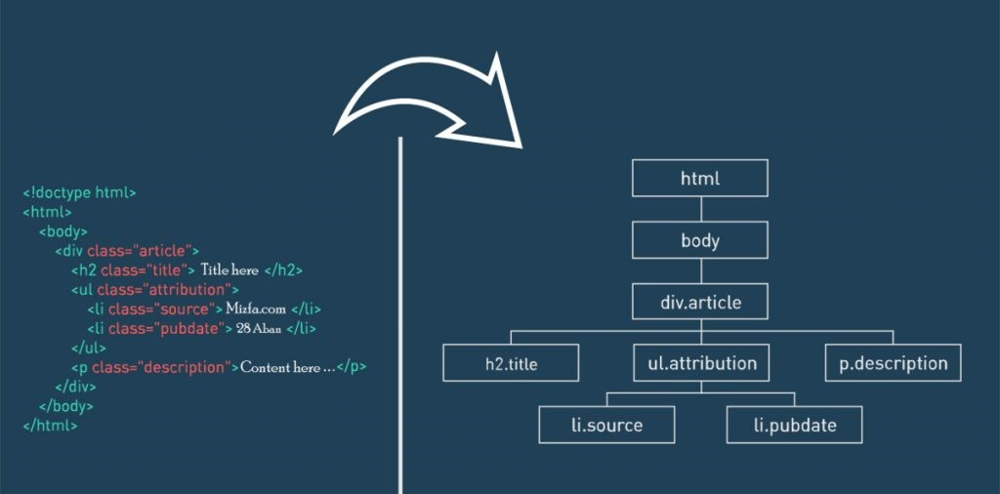
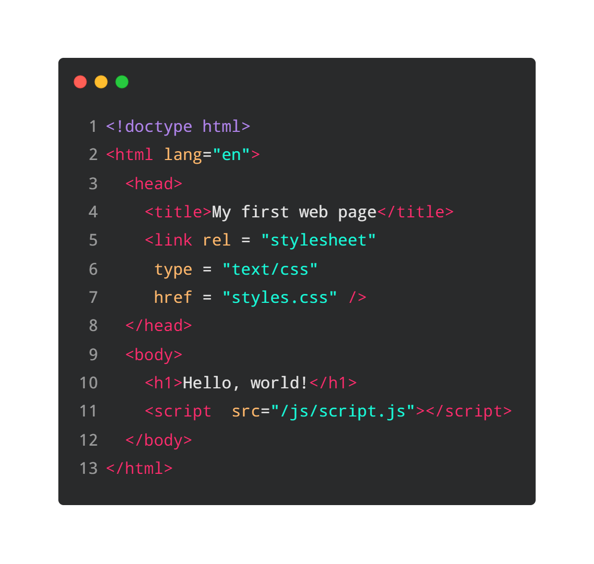

class: left, bottom
background-image: url(media/ds6.jpg)
background-size: cover
 
.left[]

 
 

# **`r rmarkdown::metadata$title`**
----
## `r rmarkdown::metadata$subtitle`
### `r rmarkdown::metadata$institute`
 
 
---
class: left, middle

# Clase 1: Introducción al Web Scraping

----

.pull-left[
.left[

* [**Recomendaciones iniciales**](#rec)

* [**Introducción**](#intro)

* [**Cuestiones éticas y legales**](#etica)

* [**Introducción a HTML**](#html)

]

] <!--end of left-column-->

.pull-right[
.left[

* [**rvest**](#rvest)

* [**Actividad**](#actividad1)

* [**RSelenium**](#rselenium)

]

] <!--end of right-column-->

---
name: rec
class: inverse, center, middle

# Recomendaciones Iniciales

---
# Informaciones

- Usaremos un script de R compartido para que puedas seguir la ejecución del código. Los scripts se compartirán en la siguiente [carpeta](https://github.com/DiegoHoliwis/Datapalooza_2023).

- Pueden seguir al instagram oficial del diplomado UC en @DataScienceUC y etiquetar en Twitter con el hashtag #Datapalooza

- Pausa programada a las 11:30hrs de 15 minutos.

.center[

]

---
name: intro
class: inverse, center, middle

# Introducción

---

# ¿Cómo funciona una página web?

- Realeza una consulta al servidor web
- El servidor determina la pagina web que quiere consultar
- Se envía la información en un formato HTML

<!-- .center[] -->
.center[

]
---
# ¿Qué es Web Scraping?

.center[]

---
name: etica
class: inverse, center, middle

# Cuestiones éticas y legales

---

# Problemas para el sitio WEB

Los propietarios de sitios WEB, justificadamente intentan protegerse de sistemas de web scraping, ya que estos pueden incurrir en problemas para ellos, por ejemplo:

- El robo de información puede otorgar al 'ladrón' ventaja competitiva
- El sitio web puede fallar, debido a que el web scraping de forma masiva puede generar un ataque DDoS
- Entre otros

.center[]

---

# Métodos de prevención del web scraping

Algunos sistemas para protegerse de web scraping son:

- **crawler anti-scraping**: Estudia el número y frecuencia en que una misma IP realiza consultas al sitio web, en el momento en que se detecte un sistema extraño esta P será bloqueada.
- **reCaptcha**: Sistema de detección de robot diseñado por Google.
- **User-Agent**: es un encabezado del sitio web para identificar como visita al usuario. Se usa información del sistema operativo, versión, tipo CPU, etc.

.center[]

---

# Directrices para un web scraping ético y responsable

Algunas directrices para no ser un web scraper malvado son:

- Preferir las API sobre el Web Scraping siempre que sea posible
- Leer los terminos y condiciones para saber si la página web esta abierta a realizar web scraping o sobre el uso de los datos web scrapeados
  - [Amazon](https://www.amazon.com/-/es/gp/help/customer/display.html?nodeId=GLSBYFE9MGKKQXXM)
  - [Wikipedia](https://es.wikipedia.org/robots.txt)
- Establecer un tiempo entre consultas adecuado. El tiempo entre ejecución puede estar publicado en los archivos robot.txt de la páginas web, en caso contrario puede esperar al menos 10-15 segundos.

---
name: html
class: inverse, center, middle

# Introducción a HTML

---

# ¿Qué es el HTML?

- HTML es el lenguaje estándar para la creación de páginas web
- Describe la estructura de la página web
- Le indica al explorador que y como mostrar el contenido
- Las etiquetas de HTML indican el tipo de contenido, sea: párrafos, títulos, vínculos, etc.

.center[]

---

# ¿Cómo funciona HTML?

.center[]

---

# Anatomia de HTML

Las etiquetas son bloques de contenido de la forma: 

`<etiqueta>` contenido `</etiqueta>`

Estas pueden contener texto u otras etiquetas, creando un sistema de árbol. Además, las etiquetas contienen atributos los cuales agregan atributos a la etiqueta, como lo pueden ser: class, id, name, placeholder, etc.

.center[]

---

# Estructura de un HTML

.center[]

---

# Etiquetas básicas

- `
` división de información dentro del contenido.
- `<a>` para enlaces.
- `<strong>` para poner el texto en negrita.
- ` ` para saltos de lineas.
- `<h1> ... <h6>` para títulos.
- `<ol>` para listas ordenadas, `<ul>` para listas desordenadas, `<li>` para elementos dentro de una lista.
- `
` para párrafos.
- `` para estilos de una parte de texto.

[Referencias](https://makeawebsitehub.com/wp-content/uploads/2015/06/HTML5-Mega-Cheat-Sheet-A4-Print-ready.pdf)

---
name: rvest
class: inverse, center, middle

# rvest para el web scraping

---
# rvest 

[rvest](https://github.com/tidyverse/rvest) es un paquete para realizar Web Scraping a página web de forma estática (sin interacción con esta) inspirado en [`beautiful soup`](https://beautiful-soup-4.readthedocs.io/en/latest/#) y [`RoboBrowser`](https://robobrowser.readthedocs.io/en/latest/readme.html)

Las principales funciones de rvest son:

- **read_html**: Extrae la información HTML de la página consultada.
- **html_node/html_element**: Extrae la información HTML del primer mach realizado, la función recibe una consulta en formato css o xpath.
- **html_nodes/html_elements**: Extrae la información HTML de todas las coincidencias con la consulta realizada.
- **html_attr**: Extrae la información del atributo del node consultado.
- **html_table**: Extrae tablas de la página web consultada.
- **html_text2**: Extrae el text del node/página consultada.

Referencias:
- Selector css: [link](https://www.w3schools.com/cssref/css_selectors.asp)
- Selector xpath: [link](https://www.w3schools.com/xml/xpath_syntax.asp)

---
name: actividad
class: inverse, center, middle

# Actividad 1

---
# Actividad

Utilizando rvest extraiga la información de de los productos en promoción del día en la página web de [mercado libre](https://www.mercadolibre.cl/). Para ello se realizarán los siguientes pasos:

1. Extraer el número de páginas que tiene mercado libre en su sección de promoción del día.
2. Obtener los siguientes atributos de los productos de la pagina 1:
  - Nombre
  - Precio sin descuento
  - Precio con descuento
  - Envío gratis
  - Envío full
  - Vendedor
  - URL
3. Crear una función que extraiga la información de todos los productos en promoción del día.

---
name: rselenium
class: inverse, center, middle

# RSelenium

---
# RSelenium

Selenium Webdriver es un herramienta que nos permite automatizar pruebas de interfaz de usuario (UI), mediante una conexión realizada por Java. 

Para establecer una conexión es requerido que se tenga instalado:
  - Navegador web
  - [Webdriver correspondiente](https://www.selenium.dev/documentation/webdriver/getting_started/install_drivers/)
  - [Java](https://www.java.com/es/download/ie_manual.jsp)

---

## Comandos útiles:

- `navigate()` inicia la página web seleccionada.
- `findElement()` busca un elemento xpath o css.
- `$getElementText()` extrae el texto del elemento seleccionado.
- `$getElementAttribute()` extrae un atributo del elemento seleccionado.
- `$clickElement()` realiza clic en el elemento seleccionado.
- `$selectTag()` retorna las opciones del elemento seleccionado, útil para revisar las opciones de un tag select
- `$sendKeysToElement(list('x'))` escribe en el elemento la palabra `x`, se utiliza en elementos input.
- `$getElementAttribute('innerHTML')[[1]]` extrae la información HTML del nodo hijo del elemento seleccionado, útil para combinar con `rvest` al realizar la extracción.
